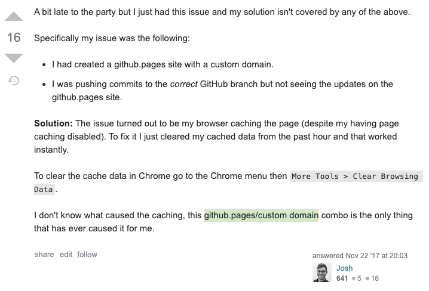

  

# About Me

wip: About Me Page 🚀

### What have I learned

- Some jQuery selector stuff and css animations;
- Boostrap 4 navbar collapse toggler and mobile responsiveness

### What's next ?

- Looking forward to migrate my css to sass/scss...
  As you can see my css syntax selector has been parent element pointing to its direct children,
  it'd be great for me to finally use nesting and variables in scss !!!

- Very excited to move my personal page to React !!!

###### \_NOTE: potential caching issues with viewing latest updates on my Github page - please see the below screenshot taken from Stackoverflow for possible solution:

